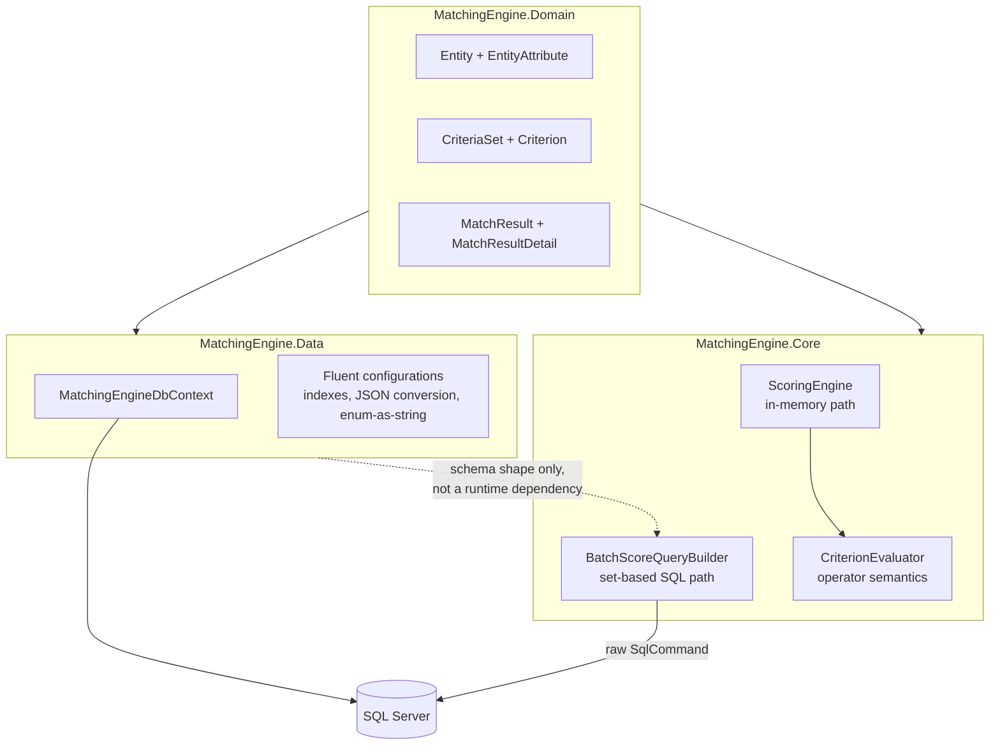

# Matching Engine

A generic rules-based matching engine: entities with arbitrary attributes,
versioned sets of weighted criteria to score them against, and a persisted,
explainable result per match. Built on .NET 9, EF Core, and SQL Server. No
domain baked in anywhere "entity" and "attribute" are the only nouns this
repo knows, on purpose (see "Problem" below).

## Problem

A lot of systems that look completely different from the outside turn out
to share the same shape underneath: does *this thing* meet *these rules*,
and if it doesn't fully qualify, how close did it get and on what basis.
Supplier eligibility, loan underwriting criteria, candidate screening,
claims triage, procurement scoring each domain has its own attributes and
its own rules, but the engine underneath doesn't need to know any of that.
What it needs is: entities with named attributes of varying types, rule
sets made of weighted, optionally-mandatory criteria, and a scored,
explainable result that says not just "72/100" but *which* criteria drove
that number. This repo is that engine, with the domain scraped off.

The interesting design problem isn't the domain there isn't one it's
that the same rules need to run two different ways: fast enough on one
entity to power an interactive "check eligibility now" page, and cheap
enough per-entity to score hundreds of thousands of them in a batch run
without turning into hundreds of thousands of round trips. Those are
different engineering problems with different correct answers, and getting
both to agree on what "satisfied" means for every operator is the actual
work.

## Architecture



Three projects, one shared vocabulary. `MatchingEngine.Domain` is plain C#
classes with no EF Core or SQL Server dependency at all `CriterionEvaluator`
and `ScoringEngine` in `MatchingEngine.Core` can be unit tested (and, in
this sandbox, oracle-verified) without a database anywhere in the loop.
`MatchingEngine.Data` is the EF Core side: a `DbContext` plus one
`IEntityTypeConfiguration<T>` per table, so each table's indexes and type
conversions are reviewable on their own. `BatchScoreQueryBuilder` sits in
`MatchingEngine.Core` rather than `MatchingEngine.Data` because it never
goes through the `DbContext` at all it hand-writes SQL and reads a
`SqlDataReader` directly, for reasons covered in "In-memory vs. batch"
below.

## The schema

Entity-attribute-value (EAV), the standard shape for "we don't know the
attributes ahead of time and don't want a migration every time a caller
adds one":

- **Entity** a generic thing being matched (`ExternalRef`, `EntityType`,
  `CreatedUtc`). `EntityType` is an opaque caller-defined string, not an
  enum this repo owns.
- **EntityAttribute** one `(AttributeName, AttributeValue)` fact about an
  Entity. Always stored as a string; typed out-of-band via `ValueType`.
- **CriteriaSet** a named, versioned bundle of criteria. Versioned rather
  than mutated in place, so a `MatchResult` from last month still points at
  the rules that actually produced it.
- **Criterion** one rule: `AttributeName`, `Operator`, `ValueType`,
  `TargetValue` (or `TargetValueList` for `In`), `Weight`, `IsRequired`.
- **MatchResult** / **MatchResultDetail** the persisted outcome of scoring
  one Entity against one CriteriaSet: total and max score, pass/fail, and a
  per-criterion breakdown of what was and wasn't satisfied.

## Decisions and trade-offs

**Hard filter + soft score, not one or the other.** Most real
eligibility/matching problems aren't purely "score everything and rank" or
purely "pass/fail a checklist" they're both at once: some criteria
disqualify outright (blacklisted, missing a mandatory certification), others
just move a ranking score. `Criterion.IsRequired` encodes the first kind.
`TotalScore` sums the weight of every satisfied criterion regardless of
`IsRequired` a required criterion can carry `Weight = 0` and contribute
nothing but a gate, or carry real weight and do both jobs. `Passed` is false
if *any* required criterion is unsatisfied, independent of how high
`TotalScore` climbed on the optional ones. See
`ScoringEngineTests.Required_criterion_failing_fails_the_whole_match_regardless_of_score`.

**A missing attribute never satisfies any operator including
`NotEquals`.** Real SQL's three-valued NULL logic would make
`NotEquals('gold')` evaluate *true* against a NULL attribute "we don't
know their tier" is not the same claim as "their tier is not gold", but
NULL propagation would treat it that way. For a scoring engine, "we never
collected this attribute" failing every criterion that references it, gate
or not, is the safer default: it can't accidentally pass an entity through
a required check on missing data. `CriterionEvaluator.Satisfied` and the
oracle both special-case `attributeValue is null` before looking at the
operator at all.

**Operator semantics live in exactly one place, tested outside the .NET
toolchain that couldn't run here.** There is no .NET SDK, no SQL Server,
and no Docker daemon in the sandbox this repo was built in which means
neither the C# nor the T-SQL for eight operators across two value types
could be compiled or executed to check they agree with each other. Rather
than ship that unverified, `verification/oracle.py` pins down the exact
truth table in a language that *could* run here, gets 16 passing tests
against it (including deliberately adversarial cases see below), and
`CriterionEvaluator.cs` / `BatchScoreQueryBuilder.cs` are direct,
line-commented translations of that oracle, not independent
reimplementations. See "Verification" for what that actually caught.

**Enums are stored as their string names, not their ints.** `Operator` and
`ValueType` columns hold `"Equals"`, `"GreaterThan"`, etc.
(`CriterionConfiguration.cs`, `.HasConversion<string>()`). This isn't just
for readability when looking at the `Criteria` table directly the batch
SQL's `CASE WHEN c.Operator = 'Equals' THEN ...` matches against these exact
strings. Storing the int would make that coupling invisible: reordering the
C# enum would silently change what every stored row means without touching
a single migration.

**`TargetValueList` is a JSON column, not a child table.** It only exists
for the `In` operator, is authored as a unit with its `Criterion`, and is
never queried independently of it normalizing it into its own table would
be textbook-correct and buy nothing. The EF Core side needs its own
`ValueComparer` for this (see `CriterionConfiguration.cs`) without one, EF
can't tell whether two `List<string>` instances with identical contents
actually changed, and will emit an `UPDATE` on every `SaveChanges` whether
anything changed or not. Easy to miss until you're staring at unexplained
writes.

## In-memory vs. batch

**`ScoringEngine.Evaluate`** takes one `Entity` and one `CriteriaSet`,
already loaded into memory, and returns a `MatchResult` with a full
`MatchResultDetail` breakdown. This is the path for "one entity, right
now" an eligibility check on a form submission, a single re-score after
an attribute changed. It's also the only path that's unit-testable without
a database, which is why the operator semantics were proven here first.

**`BatchScoreQueryBuilder`** is the other end of the same problem: score
every entity against a `CriteriaSet` in one set-based SQL query
`CROSS JOIN Entities x Criteria`, `LEFT JOIN` each entity's attribute value,
one per-operator `CASE`, then `SUM`/`MIN` `GROUP BY` entity. Running
`ScoringEngine` in a loop over 400,000 entities means 400,000 dictionary
builds and, if attributes aren't eagerly loaded, 400,000 round trips; the
batch query does the whole pass as one query plan. The trade-off: it
returns only the aggregate (`TotalScore`, `MaxPossibleScore`, `Passed`) per
entity, not a `MatchResultDetail` row per criterion. Getting the "why" at
batch scale means re-running `ScoringEngine` for just the entities the
batch pass flagged usually a small set rather than paying for a
per-criterion breakdown on all 400,000 rows when a human will only ever
look at a few hundred of them.

This is also why `BatchScoreQueryBuilder` talks to `SqlConnection`/
`SqlCommand` directly instead of going through `MatchingEngineDbContext`:
which `CASE` branch fires depends on a row's own `Operator` column, a
genuinely dynamic, data-driven predicate that LINQ-to-Entities has no way to
translate into SQL. `FromSqlInterpolated` or raw ADO.NET is the honest
answer here, not a workaround for a LINQ limitation see the EF Core
pitfalls note below for where that boundary tends to get crossed by
accident instead of on purpose.

## Verification

No .NET SDK, no SQL Server, no Docker daemon in this sandbox so nothing
in `src/` or `tests/` was compiled or executed here. What *was* run, for
real, is `pytest verification/` (16 tests, all passing):

- **`test_oracle.py`** (13 tests) pins down every operator's semantics
  case-insensitive string equality, numeric comparison via a `TRY_CAST`-style
  parse that fails closed instead of throwing, `Contains`/`In` membership,
  the missing-attribute and wrong-value-type edge cases, and the
  required-criterion gating rule against `oracle.py`, a plain-Python
  reference implementation with zero framework dependencies.
- **`test_sqlite_batch_verify.py`** (3 tests) proves the *set-based SQL
  aggregation shape* `CROSS JOIN` + `LEFT JOIN` + per-operator `CASE` +
  `SUM`/`MIN` `GROUP BY` produces identical results to the oracle, using
  SQLite as a stand-in engine since no SQL Server was available to run the
  real T-SQL against. One of those three tests
  (`test_naive_cast_is_wrong_try_cast_is_right`) exists because this
  verification step caught a real bug: SQLite's own `CAST('n/a' AS REAL)`
  silently returns `0.0` rather than erroring or returning `NULL`, which is
  the *opposite* of `TRY_CAST`'s contract and left unguarded turns
  "attribute missing or garbage" into "attribute equals zero", flipping the
  answer on an `Equals`/`Number` criterion comparing against a target of
  `"0"`. The fix was a small numeric-format guard (`is_num()`) before every
  cast; the test asserts the naive, unguarded version actually gets it
  wrong, so the guard doesn't quietly become dead code later.

`CriterionEvaluator.cs` and `ScoringEngine.cs` are line-for-line
translations of the parts of `oracle.py` that passed; `xUnit` tests exist
for both (`tests/MatchingEngine.Tests`, mirroring the Python test names one
to one) but weren't run there's no `dotnet test` here. Treat them the way
you'd treat carefully-reviewed-but-uncompiled code: probably right, worth
running before trusting in CI.

`BatchScoreQueryBuilder.Sql` is the T-SQL dialect of the same query the
SQLite test already proved correct `TRY_CAST` instead of a guarded `CAST`,
`OPENJSON` instead of `json_each`, `CHARINDEX` instead of `INSTR` kept as
close as possible, branch for branch, to the query that actually passed,
specifically so that dialect translation is the only new risk, not the
underlying logic.

**Sample output**, hand-traced against `oracle.py` (not actually run through
`dotnet run`, for the same reason as everything else above) for the
scenario `src/MatchingEngine.Demo/Program.cs` seeds:

```
Scoring 4 entities against 'SupplierEligibility' v1 (5 criteria)

SUP-001: 8/8  Passed=True
    [PASS] certification_tier Equals -> +3
    [PASS] annual_volume GreaterThanOrEqual -> +2
    [PASS] region In -> +2
    [PASS] notes Contains -> +1
    [PASS] blacklisted Equals -> +0 [required]

SUP-002: 4/8  Passed=True
    [fail] certification_tier Equals -> +0
    [PASS] annual_volume GreaterThanOrEqual -> +2
    [PASS] region In -> +2
    [fail] notes Contains -> +0
    [PASS] blacklisted Equals -> +0 [required]

SUP-003: 6/8  Passed=False
    [PASS] certification_tier Equals -> +3
    [PASS] annual_volume GreaterThanOrEqual -> +2
    [fail] region In -> +0
    [PASS] notes Contains -> +1
    [fail] blacklisted Equals -> +0 [required]

SUP-004: 5/8  Passed=True
    [PASS] certification_tier Equals -> +3
    [fail] annual_volume GreaterThanOrEqual -> +0
    [PASS] region In -> +2
    [fail] notes Contains -> +0
    [PASS] blacklisted Equals -> +0 [required]
```

SUP-003 is the interesting row: it scores higher than SUP-002 (6 vs. 4) but
fails outright because it's blacklisted exactly the hard-filter-plus-
soft-score behavior the schema is built around. SUP-004 exercises the
missing-attribute path (`annual_volume` and `notes` were never collected)
both fail closed rather than erroring. `docker/init/seed.sql` seeds this
exact scenario into SQL Server; if you have the SDK and a running database,
`BatchScoreQueryBuilder.RunAsync` against it should reproduce these same
four totals.

## Performance notes

**The one index this whole engine's read performance depends on:**
`EntityAttributes (EntityId, AttributeName)`, unique. Every criterion
evaluation in-memory or batch is fundamentally "find this entity's
value for this attribute name". Without this index, the batch query's
`LEFT JOIN` degrades from an index seek per row to a scan, and at a few
hundred thousand entities x criteria that's the difference between seconds
and minutes.

**EAV's real cost is at the tail, not the top.** A handful of attributes
per entity, a handful of criteria per set EAV is fine, arguably the
right call. The classic failure mode is a *hot* attribute: one that's on
nearly every criteria set and gets checked constantly, where the
generic `(EntityId, AttributeName)` lookup starts showing up disproportionately
in query plans compared to what a dedicated column would cost. "Attribute
promotion" adding a real, indexed, typed column to `Entities` for that
one attribute and having the evaluator check it first is the standard
escape hatch, kept out of scope here because it needs a real, running
system to know *which* attribute actually earns it; guessing would just be
premature optimization with extra steps.

**In-memory vs. batch is a real trade-off, not just "batch is always
better".** The batch query pays a `CROSS JOIN` of every entity against
every criterion in the set up front for one entity against five criteria
that's five rows of overhead for no benefit over just calling
`ScoringEngine.Evaluate` directly. It starts winning when the number of
entities makes N round trips (or N in-memory dictionary rebuilds without
eager loading) the actual bottleneck, not before.

**EF Core pitfalls this design has to actively watch for:**

- *Client-side evaluation.* Anything resembling
  `entities.Where(e => CriterionEvaluator.Satisfied(...))` looks like it
  should work and instead pulls every row into memory before filtering,
  silently, because `CriterionEvaluator.Satisfied` can't translate to SQL.
  This is exactly why the batch path exists as a hand-written query instead
  of an attempted LINQ expression.
- *N+1 via lazy navigation.* Loading `Entity` without `.Include(e =>
  e.Attributes)` and then reading `.Attributes` per entity in a loop is one
  query per entity. `ScoringEngine.Evaluate` assumes attributes are already
  loaded for exactly this reason it's the caller's job to eager-load
  before calling it, not the engine's job to hide a lazy-load behind a
  clean-looking API.
- *No-tracking for read-only batches.* Any bulk read that isn't going to be
  mutated and saved back (loading entities to hand to `ScoringEngine` in a
  loop, for instance) should use `AsNoTracking()` otherwise EF Core's
  change tracker pays to snapshot every row for a change-detection pass
  that will never run.
- *Projection over full entity loads.* If a caller only needs
  `EntityId`/`TotalScore`/`Passed` from `MatchResults`, `.Select(...)` into
  a DTO before materializing beats loading full `MatchResult` +
  `MatchResultDetail` graphs and throwing most of it away.

## Failure modes

| Failure | What happens | Why |
|---|---|---|
| Criterion authored with a numeric operator against a `String`-typed attribute | Evaluates to "not satisfied", no exception | Fails closed by design (`CriterionEvaluator.Satisfied`, `oracle.evaluate_criterion`) one bad `Criterion` shouldn't take down evaluation of an entire `CriteriaSet`. Should be caught by authoring-time validation before it ever reaches evaluation; not yet built here (see "What I'd do differently"). |
| Attribute value present but not parseable as a number for a `Number`-typed criterion | Same as above not satisfied | `TryCastNumber`/`try_cast_number` return null/None rather than throwing, matching `TRY_CAST`'s contract, not `CAST`'s. |
| Two entities upserted with the same `(EntityType, ExternalRef)` | Unique index violation | Deliberate `(EntityType, ExternalRef)` is the caller's natural key; a silent duplicate would double-count that entity in every batch run. |
| `TargetValueList` used with an operator other than `In` | Silently ignored | Only `In`'s branch reads it; not validated at write time yet same authoring-validation gap as above. |
| SQL Server default (case-insensitive) collation vs. a case-sensitive one | String-operator results diverge from the oracle's `OrdinalIgnoreCase` semantics | Documented, not handled — see the `Contains`/`Equals` comments in `BatchScoreQueryBuilder.Sql`. Would need explicit `LOWER()` wrapping to be collation-independent, at some cost to index usage. |

## What I'd do differently

Criterion authoring-time validation is the biggest gap right now, a
`GreaterThan` on a `String`-typed attribute is a silent no-op discovered
only by staring at unexpectedly-low scores, when it should be a rejected
`Criterion` at creation time. `ValueType` is also deliberately minimal
(`String`/`Number` only) `Date` and `Boolean` are real, common needs that
were left out because each one adds its own casting and comparison rules to
three places that have to agree (`oracle.py`, `CriterionEvaluator.cs`,
`BatchScoreQueryBuilder.Sql`), and adding them without a compiler or a
database to check the translation against felt like the wrong moment to do
it. "Attribute promotion" for hot attributes is designed-for but not built,
for the same "needs a real workload to know which attribute" reason as the
performance notes above. And this repo ships hand-written DDL
(`docker/init/schema.sql`) instead of a real EF Core migration only because
`dotnet ef` needs the SDK the first thing to do with a working toolchain
is throw that file away and generate a real migration from
`MatchingEngineDbContext` instead.

## Running it

The in-memory demo needs nothing but the SDK:

```bash
dotnet run --project src/MatchingEngine.Demo
```

The full stack, SQL Server included:

```bash
./scripts/init-db.sh          # starts SQL Server via docker-compose, applies schema.sql + seed.sql
dotnet test                    # tests/MatchingEngine.Tests
```

Independent of either: the part that's actually been run in this repo's own
build process

```bash
pip install pytest
pytest verification/ -v
```

## Layout

```
src/
  MatchingEngine.Domain/     Entity, EntityAttribute, CriteriaSet, Criterion, MatchResult, MatchResultDetail -- no EF dependency
  MatchingEngine.Data/       DbContext + one IEntityTypeConfiguration per table
  MatchingEngine.Core/       CriterionEvaluator + ScoringEngine (in-memory), Batch/BatchScoreQueryBuilder (set-based SQL)
  MatchingEngine.Demo/       runnable console demo, no database required
tests/
  MatchingEngine.Tests/      xUnit -- CriterionEvaluatorTests, ScoringEngineTests (mirrors verification/test_oracle.py)
verification/
  oracle.py                  reference implementation of every operator's semantics
  test_oracle.py             13 tests against the oracle -- actually run
  test_sqlite_batch_verify.py  3 tests proving the set-based SQL shape matches the oracle -- actually run
docker/init/
  schema.sql                 hand-authored SQL Server DDL (see "What I'd do differently")
  seed.sql                   seeds the exact scenario MatchingEngine.Demo runs, for batch-vs-in-memory comparison
docker-compose.yml          SQL Server 2022
scripts/init-db.sh          starts SQL Server, applies schema.sql + seed.sql
```
